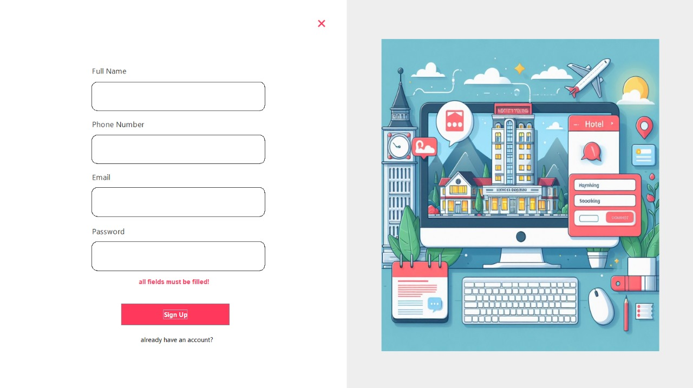
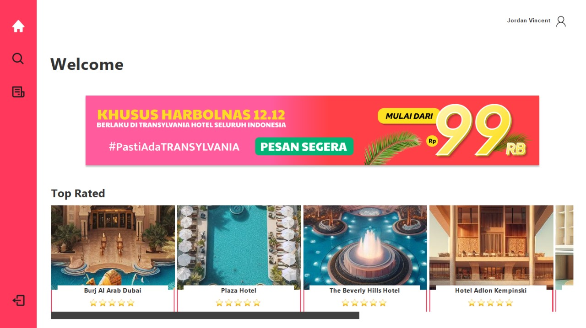
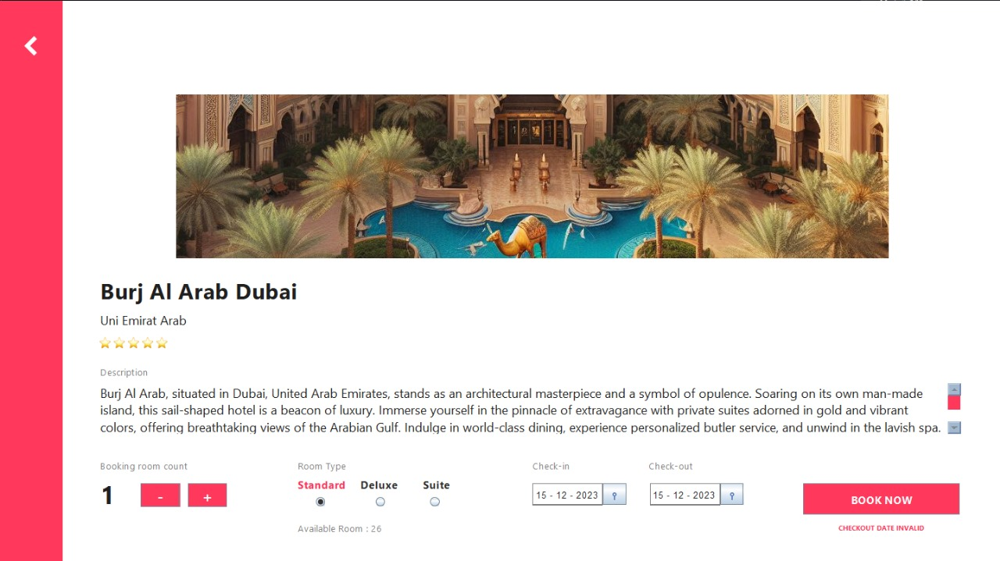
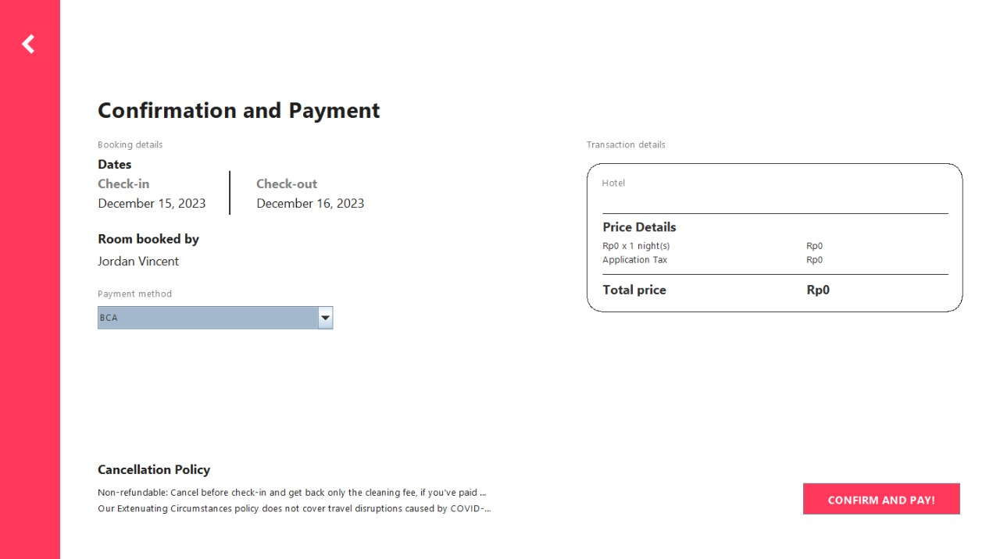

# Hotel Reservation App

This is a simple hotel reservation application built using Java's Swing and AWT for the front-end and MySQL for the database.

## Features

- **User Authentication:** Allows users to create accounts and log in securely.
- **Admin Authentication:** Allows users to log in as an admin and edit the database
- **Reservation Management:** Enables users to make, view, modify, and cancel reservations.
- **Database Integration:** Uses MySQL to store user information, reservation details, etc.
- **UI with Swing and AWT:** Provides a graphical user interface for easy interaction.

## Requirements
- Java Development Kit (JDK)
- MySQL Database
- JDBC driver for MySQL
- Swing and AWT libraries

## Installation and Setup

## Usage
- **Login/Register:** Use the provided interface to log in or create a new account.
- **Make Reservation:** Once logged in, navigate to the reservation section to book a room.
- **View/Edit Databases:** Access and modify the hotel as needed.

## Contributors
A Final Exam Group Project Made by : 
- Me
- [Stevanus Ryan](https://github.com/stevanryan)
- [Felicia Kireina](https://github.com/feliciakireina)
- [Jordan Vincent](https://github.com/ZeroFairy)

## Previews
**Login / Signup View** 

**Signup Preview** 

**Home Page Preview** 

**Hotel Details** 

**Payment**  

## Acknowledgments

- This app uses [MySQL](https://www.mysql.com/) for the database.
- Built with Java's [Swing](https://docs.oracle.com/javase/8/docs/api/javax/swing/package-summary.html) and [AWT](https://docs.oracle.com/javase/8/docs/api/java/awt/package-summary.html) libraries.
